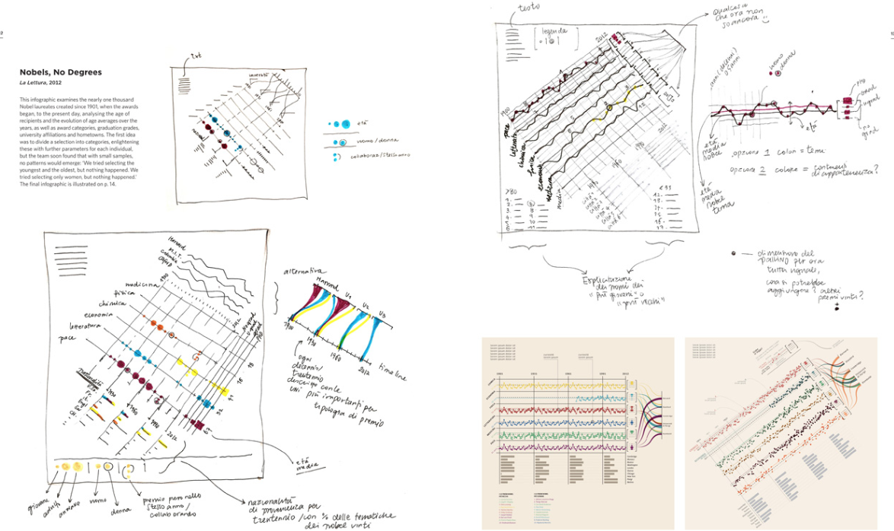

# Challenges and assignments
Three elements will make up your final grade:
1. Data Visualization definition
2. Obesity vs. Education Challenge
3. Educ vs. Fertility Challenge
3. Group work
---

## What is Data Visualization?  (personal, in-class)
+ Using your own words, make up **your personal** definition of Data Visualization.
+ **Due date:** end of **Day One**
---

## Obesity vs. Education   (personal, in-class)
> **« Obesity is on average inversely proportional to the average education of the population »**

*Can you show the evidence for this assertion?*

+ Data set
  - [In CSV format](data/ObesityvsEducation.csv)  
  - [In Excel format](data/ObesityvsEducation.xlsx)  
    > Note that Excel has additional columns which are not necessary. Feel free to modify the data set.

+  **Questions to answer**:
    1. What is the average **percentage of obese people** in all states?
    2. Which **state** has the largest percentage of its population that obtained a BA (Bachelor’s degree or higher)?
    3. A majority of states have **greater** percentages of `obese people` or `educated people`
    4. **Mockup** a Visualization that shows the evidence (or not) of the assertion. Explain your choice in terms of Chart Type and Visual Elements used.

+ **Due date:** end of **Day One**
---
## Fertility vs. Education (personal)
+ Data set
  - [In Excel format](data/Educ-Fertility.xls)  
    > Note that Excel has additional sheets which where used to form the main dataset. Feel free to modify the data set.  

+  **Work to be done**:
    1. Guess a business question from the name of the dataset and make an assertion for yourself.
    2. Identify the data (categories, data type, ...) and build a visualization or several visualizations that validates, invalidates your assertion.
    3. What are the findings from your visualization?
    4. Explain your choice in terms of visual elements used.

+ **Due date:** before beginning of **Day Two**

## Group work
+ Form **groups of 4 to 5** so classroom is represented by 10 groups. Give your group a name and give the composition of the group to your instructor.
+ **Identify a business challenge**, a societal issue, a fact, sport related events or anything your is interested in and with which you are comfortable with.
+ Phrase the business challenge and submit it to your instructor along with your group name.
> Lacking inspiration? Here are some examples
> - Politics, Societal Factors:
      - Visualizing Urban Expansion
      - Visualizing Healthcare spending
      - Visualizing Food poisoning outbreaks and crisis
      - Study on Domestic Violence
      - Visualizing a country's elections
      - Visualize your Taxes
> - Retail, Commerce, Marketing
      - Visualizing Black Friday shopping
      - What products are trendy
      - The impact of iPhone on Retail behavior
> - Industry, Energy and Utilities
      - World's Oil Producing countries
      - Green energy production vs. Nuclear/Coal energy production
> - Sports, Media, Misc
      - Visualize Oscar winners
      - Football World Cup top scorer
      - Most used words in song lyrics
      - Summer vs. Winter Olympics country performances

+ **Identify needed data** (see [Appendix](#Appendix) to get a list of website with datasets. Google is your friend). Think about what is available in the form of APIs, Open Data but also what might be missing. *It is ok to identify missing data that would have helped enrich your data visualization as long as you explain it*  
+ Sketch your Data Visualization choosing the appropriate supporting Visual Elements (charts, colors, text, headlines etc...)
+ Get your story right in order to present to the audience.

> + **Tip1:** as you are building your visualization, document your decision points in order to present the "Making Off" which counts for the final grade  
> + **Tip2:** use the tools you already now, copy paste if needed to 'scrap' something meaningful. **Remember, IT DOES NOT HAVE TO BE A FULLY COMPLETED DATA VISUALIZATION**  

> You have seen the Nobel Prices and Laureate visualization during the lectures, here is an example of the sketch:

+ **Presenting in front of the audience** is a timed presentation (more or less 10 min by groups). Split your timing in two sections:
    1. Presenting you sketch or mockup as if you were presenting in front of an audience of stakeholders or during a conference. Make it impactful. **Remember that you are in the position of a story teller**
    2. Present what is behind the cover, your design choices as if you were in the shoes of the data scientist and designer teams. **Remember to highlight concepts you have learned**
    3. Be prepared for **Q&A** from the class and the instructor.
---

## Appendix
+ World Resources Institute (multi domain data sets, contains data visualizations) - http://datasets.wri.org/dataset
+ Forbes (multitude of Companies, personalities listings) - https://www.forbes.com/lists
+ Statistical Computing (selection of US related datasets) - http://stat-computing.org/dataexpo/
+ Quora Wiki List of open Large Datasets https://www.quora.com/Where-can-I-find-large-datasets-open-to-the-public
+ US Data.gov (200K Government related datasets) https://www.data.gov/
+ Government data sources (many several cities or Gov Agency publish open data)
+ GovLoop http://data.govloop.com
+ City of Seattle http://data.seattle.gov
+ City of San Francisco http://data.sfgov.org
+ City of Chicago http://data.cityofchicago.org
+ Medicare data  http://data.medicare.gov
+ 1001 Datasets and Data repositories (List of lists of lists...) https://dreamtolearn.com/ryan/1001_datasets
+ Kaggle ( the Home of Data Science & ML ) https://www.kaggle.com/datasets
+ DataCite (find, access and reuse data ) https://search.datacite.org/
+ Re3data.org (registry of research data repositories) https://www.re3data.org/
