# Watson Studio Visualizations
In this series of labs we will cover several data visualization capabilities provided by **IBM Watson Studio**:
* Two **IBM Watson Studio** programatic visualization add-ons on top of the regular support provided by Jupyter Notebooks and its cohort of visualization librairies (`matplotlib`, `seaborn`, `ggplot`, ...):
  * **Brunel**
  * **PixieDust**
  * **Seaborn**
  * The **IBM Watson Studio Dashboards** service, with a UI-driven capability to build and publish dashboards largely inspired by **IBM Cognos Analytics** capabilities.

## Brunel Visualizations
Brunel is an IBM-contributed open source tool designed to generate powerful visualizations with no 'plumbing' or boilerplate code.   
Brunel will allow to build complex displays from `Pandas DataFrames` with only a single declarative line describing the display.

Brunel has been integrated as an add-on to Jupyter notebooks and is included in the DSX setup.  

> If you are interested of understanding more about Brunel, feel free to explore the following resources:
> * Brunel GitHub repo: <https://github.com/Brunel-Visualization/Brunel>
> * Brunel documentation: <https://brunel.mybluemix.net/docs/>
> * Brunel Visualization Tech Talks: https://developer.ibm.com/code/videos/brunel-visualization-tech-talk/

The hands-on will be driven by the `Visualize_car_data_with_Brunel_cleared.ipynb` notebook, using data from the `cars.csv` file.

### Lab Setup
* From your `Data Storytelling` project's `Assets` tab, add the `cars.csv` file as Data Asset if not already part of your `Assets`
* Create a new Notebook from the file  `Visualize_car_data_with_Brunel_cleared.ipynb`, with a Spark runtime as in the first lab: 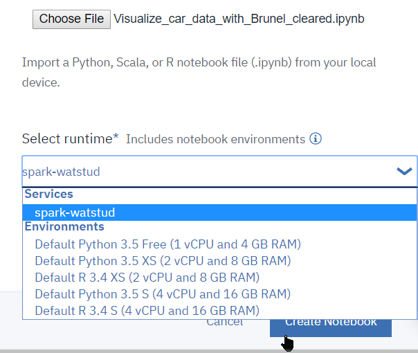  

* Follow the instructions within the notebook and come back to this material once completed.

## PixieDust Visualizations
### What is PixieDust
**PixieDust** is an IBM-initiated open source framework for interactively exploring Spark-based data sets within Jupyter Notebooks.   

### PixieDust and PySpark
The `Panda dataframes` that we have used in the previous lab are loaded in the Python address space of the Jupyter Notebook, and processed using their Python VM's compute resources.   

When dealing with larger datasets, **PySpark** is used to load data and run computations in a set of Spark executor instances, but there is no direct and easy way to handle some aspects of Spark dataframes handling such as visualization which usually has to be converted back to Pandas.   
**PixieDust** is designed to handle Spark DataFrames to provide interactive display capabilities for Spark DataFrames based on their structure, and then let the user interactively modify the visualization style to explore a dataset.

### Lab introduction
The notebook used in this hands-on lab makes use of **PixieDust** capabilities to handle a Spark dataset, such as direct downloading of dataset from source URL, and interactive visualization.

The notebook is about analyzing traffic incidents from the city of San Francisco, based on the Open Data set provided by the authorities.

* Create a new notebook from file, selecting  `pixiedust-traffic-analysis_cleared.ipynb` as source, and as previously a Spark engine environment notebook: 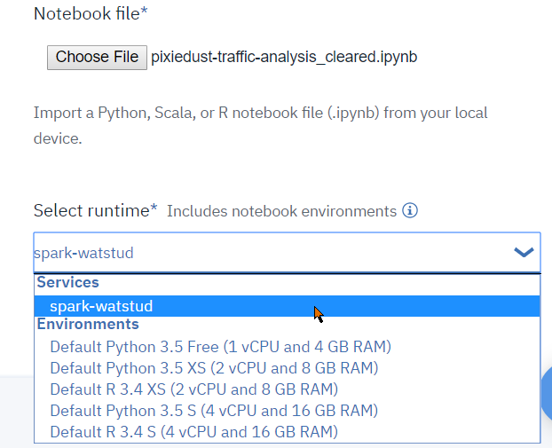  

* Follow the instructions in the notebook. You will notice that the notebook uses the **PixieDust** display widget to guide you through interaction with the data, and therefore there is not a lot of actual code used in this notebook.

## Seaborn Visualizations
**Seaborn** is a Python data visualization library based on `matplotlib`. It provides a high-level interface for drawing attractive and informative statistical graphics.
If you want to learn more on **Seaborn** visit the [project page](https://seaborn.pydata.org/) which has a lot of examples and galleries.

To see how powerful and easy **Seaborn** is, let's do a lab.
From your **Watson Studio** project page, click on `Add to Project` and select `Notebook`.
Give your notebook a name and provide either the `notebook file` either the `URL` from GitHub for the notebook **UltimateSeabornTutorial.ipynb**

## Watson Studio Dashboard
**IBM Watson Studio** has a built-in capability to build interactive publishable dashboard.

### Setting up a dashboard
1. Back to your project's Assets list, navigate to the `Dashboards` section and select `(+)New dashboard`: 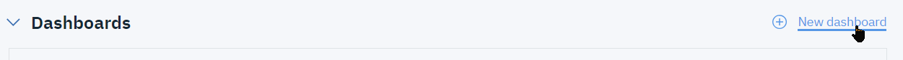
1. Enter a name, e.g. `NYC Bike Rentals`
1. We will need to create a dashboard service instance, select the `Associate a Cognos Dashboard Embedded service instance` link 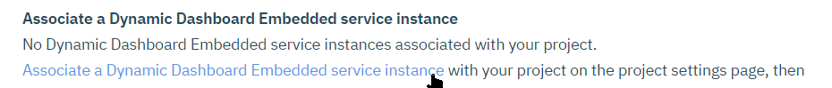
1. Choose the 'Lite' configuration, and confirm default org and space
1. Click the `Reload` link and select the instance, then the `Save` button: 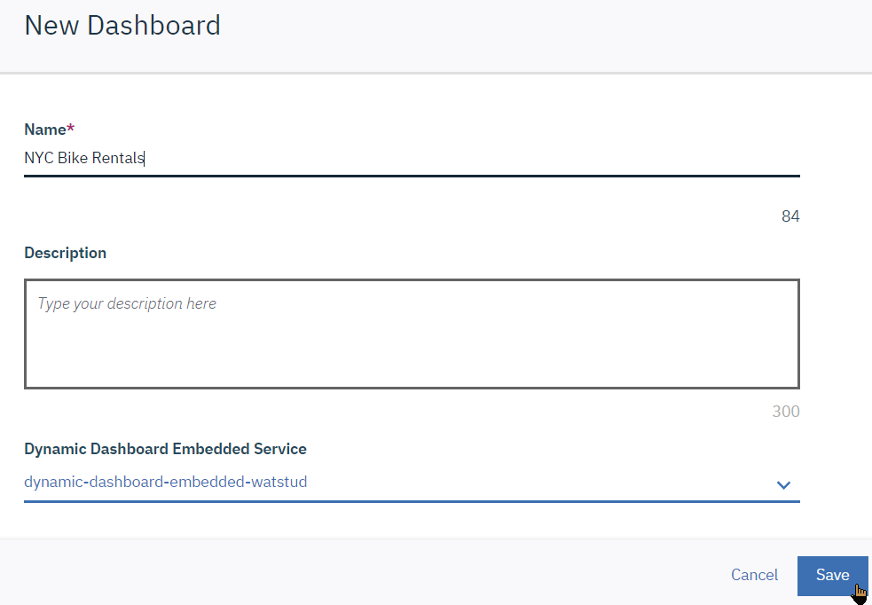
1. In the `Select a template`, use `Tabbed` and `Freeform`: , then `[OK]` button.

### Adding data to a dashboard
We will use the data produce by Data Refinery for the NYC bike share dataset.
1. In Select 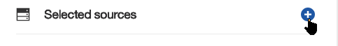
1. Select the `201701-citibike-tripdata_cleansed.csv` file: 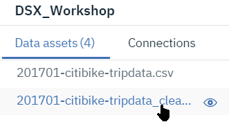
1. The dashboarding has the ability to propose a graph type based on the data. We will start by displaying the `Trip Duration` by `Age`:
    1. Drag&Drop the `Trip_Duration` from the data panel on the left to the dashboard canvas on the right;  The `Trip_Duration` total aggregated sum is displayed as a big number:  
     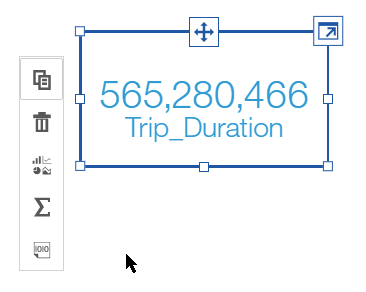
    1. Drop the `Age` field onto the `Trip_Duration` widget: 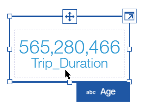
    1. **IBM Watson Studio** changes the graph to a more suitable representation, in this case a bar graph: 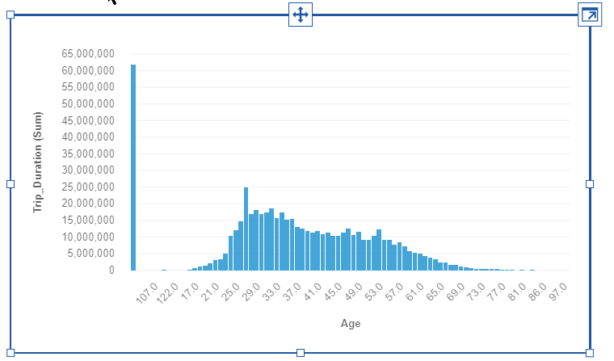
    1. Unfortunately, our data has not been cleansed enough and we have erroneous values for `Age`. Right-click on the `Age` label to display the menu, and select the filter icon 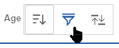
    1.  In the filter definition box, select all values which do not make sense (no value, values above 100): 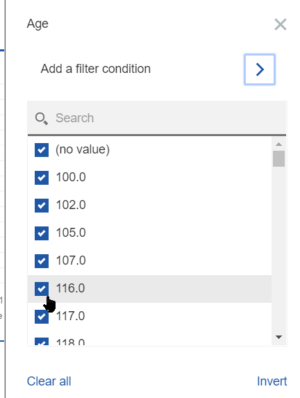, then click the `Invert` button and OK. We get a better-looking graph where we can see the trip duration distribution by age 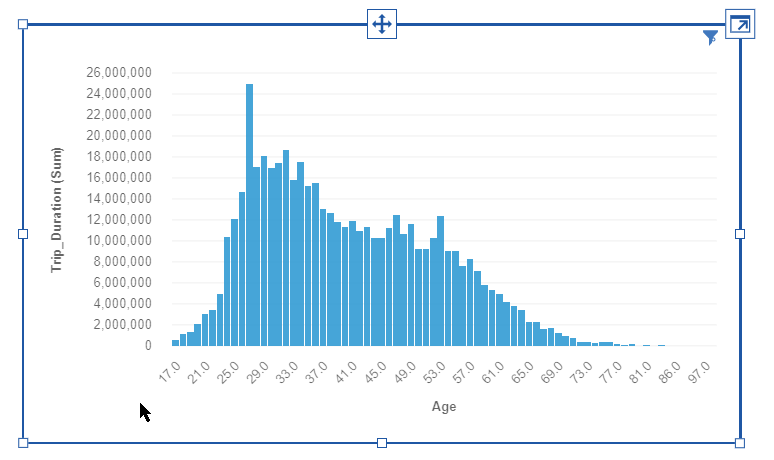.
1. Now add a new Freeform tab 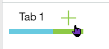 and we will create a map display of the stations by count of rentals

    1. Select the two Start_Station_Latitude and Longitude field and drop them on the canvas: 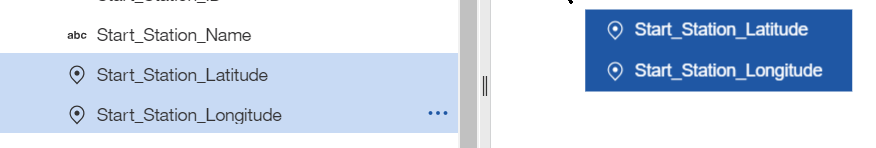
    2. The system automatically creates a map display: 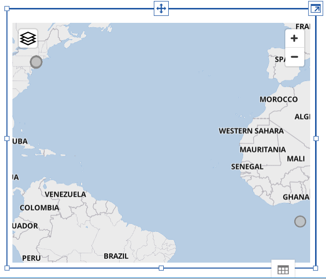
    3. Unfortunately, there is some parasistic data with erroneous coordinates that show up in the middle of the ocean at coordinate (0,0) below the African continent. Click on the map and select the `Change visualization` icon: 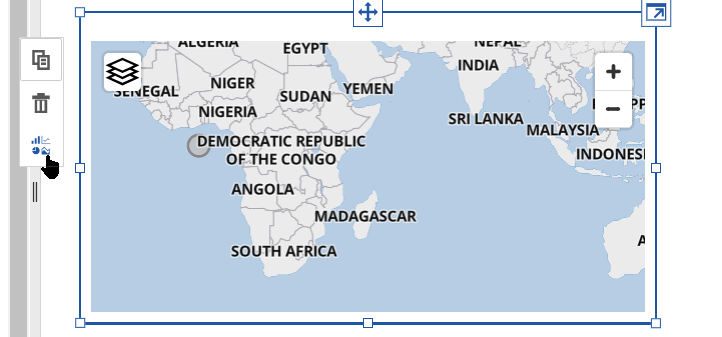
    4. Click on the `More`: 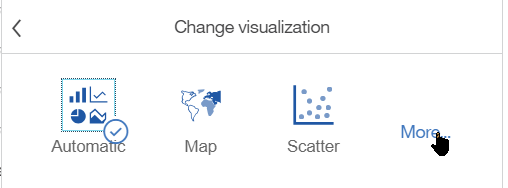, confirm automatic type, which is a `Map`
    5. Expand the `Latitude/Longitude`: 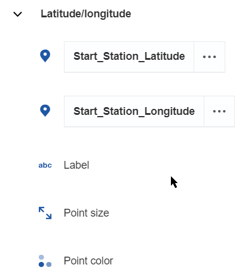, then select filter 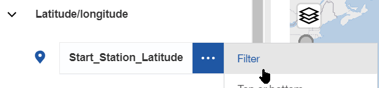
    6. In the filter definition, select the first `0` value, then `Invert` and OK button. The map will center itself on NYC: 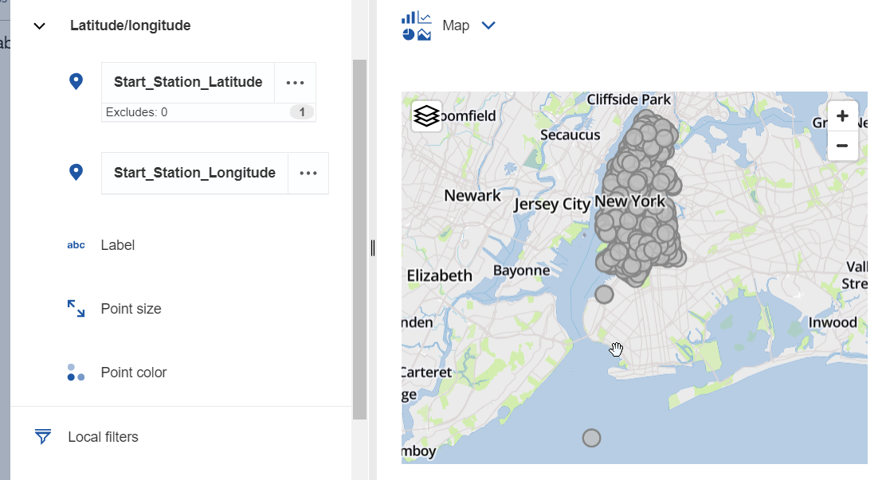
    7. Drop the `Station_Name` onto the `Label`: 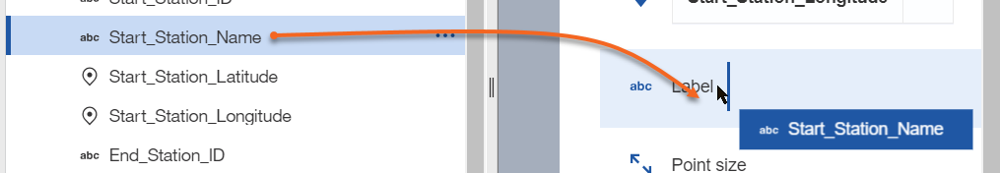
    8. We see on the map an outlier, south on the ocean, we can filter it out by name, as we can get the `8D OPS 01` label now by hovering over it. Click the Filter button for `Label`, and enter a `Does not start with` condition for `8D OPS`: 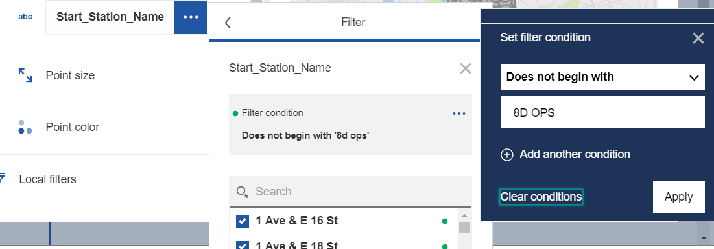. The outlier point will disappear from the display.
    9. Drop the `Trip_Duration` field onto the `Point color`. The default aggregation is `SUM` which will show stations from where the cumulative trip are longer. This shows that a few stations are issuing longer rides than others, as they show in darker colors: 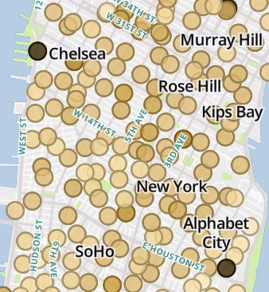
    10. Change the aggregation used for the coloring, now based on the average trip duration. Select `Trip Duration`->`Summarize`->`Average`:.
    11. All points now look similar. You can remove outlier manually by right-click selecting them on the map and selecting `exclude`: 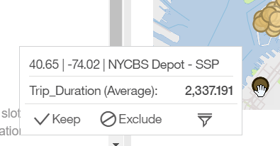
1. Many other types of graphs can be built, as an exercice, build:
    1. a graph on another tab that will show the distribution of rentals by the hour of the day and user type. You should end up with a graph such as: 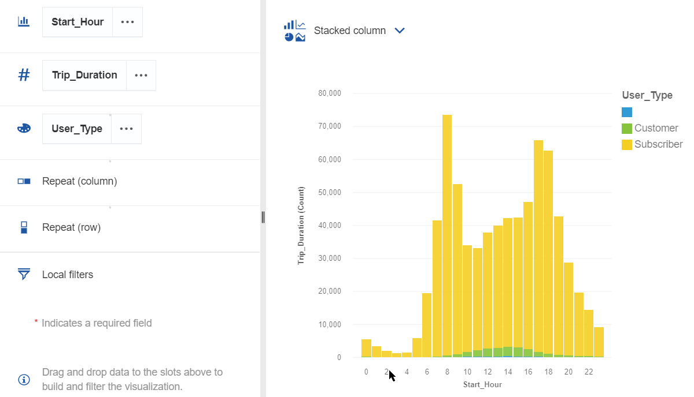
    1. And last, build a graph that shows usage by date: 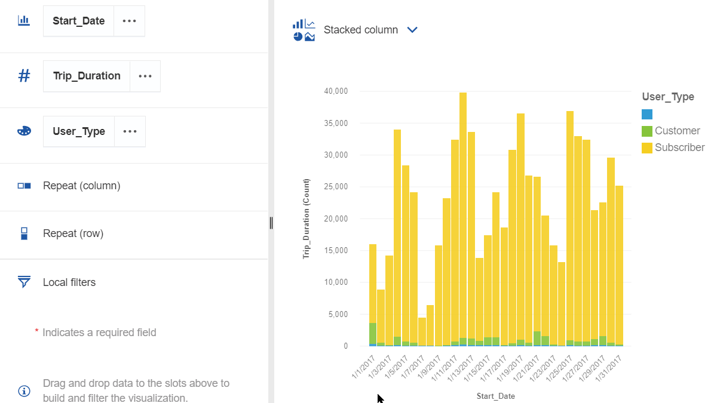. We see the weekly cycle, and probably the impact of weather conditions.
1. Graph elements can also act on others on the same tab. On the last tab you created, drop a `User_Type` field. This will drive the beahvior of the usage by date graph: 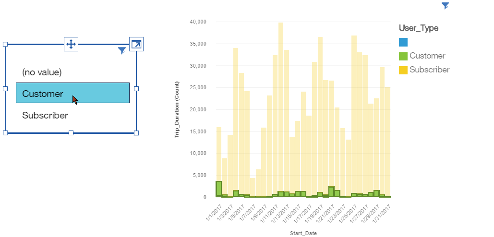
1. Finally, dashboards can be published:
    1. Click the `Share` icon: 
    2. Enable sharing: 
    3. Open the link from another tab or browser to get a web view on the dashboard
