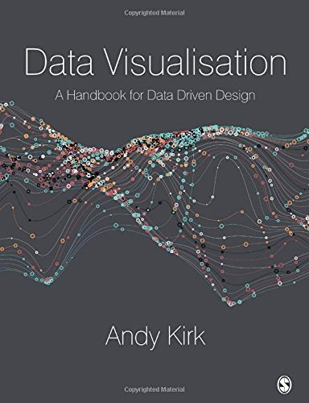
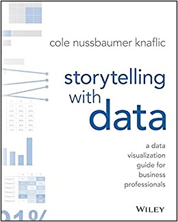
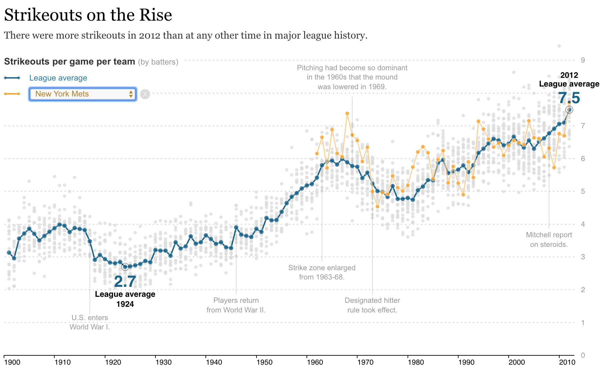
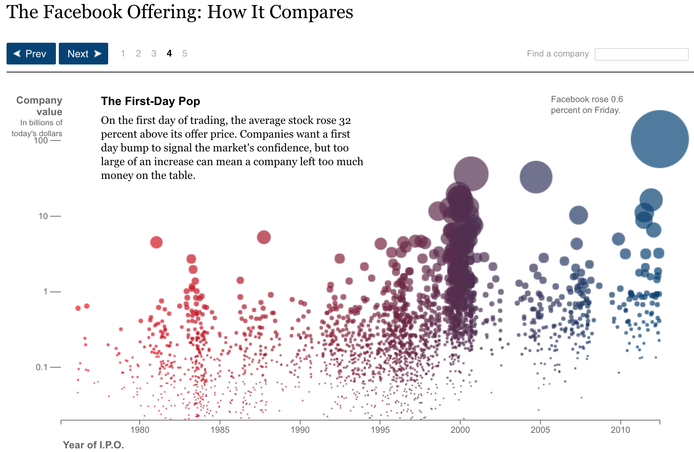
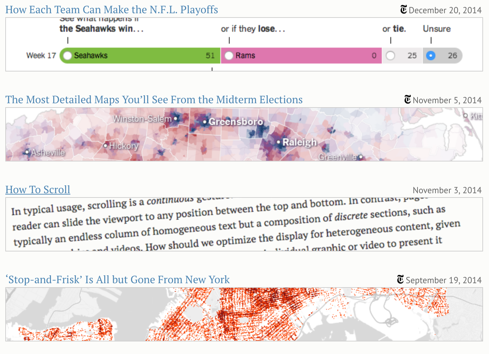

# Data Storytelling
This repository contains all the needed information for the **Data Visualization and Storytelling** course.  
The objective of the course is to emphasize on principles, theory, processes and techniques used to build effective visuals helping students to choose the best way to show data, understand data and communicate with data. Practical application of data visualization will give students some of the foundations needed:
  * to present data using engaging and impactful visual design
  * to go deeper and grow additional skills in data visualization using other tools

## Graded Exam & Assignment
All the information related to grading and the personal and group work is available here:
- [Challenges and assignments](./Challenges.md)
- If you have doubts or you're not sure what os expected, ask your instructor as soon as possible.

## Course setup
For the Lab section of the course, students will use **IBM Watson Studio** which is an **IBM Cloud Service**.  
The tasks needed to setup your Lab environment are the following:
1. Create an **IBM Cloud** account ([instructions](./setup/ibm_cloud.md))
2. Create the **IBM Watson Studio** instance ([instructions](./setup/ibm_watson.md))
3. Load the needed data files into the project as Data Assets

## Course labs
Practical Hands-on experience will be provided during the Labs. List of Labs is available here, clicking on the link will direct you to the Labs instructions.
+ [Visualization using **IBM Watson Studio**](./Lab2-Visualizations/Lab2-Visualization.md)
  - **Brunel** Visualization
  - **Pixie Dust** Visualization
  - **Seaborn** Visualization
  - Embedded Dashboards

## Resources
This section covers all additional resources which you might want to explore to get a broader understanding of some of the major Visualization libraries, techniques, tools and so on.
It includes tutorials, related web sites, course material.

### Readings and Videos
+ **Data Visualisation** *A Hanbook for Data Driven Design* by **Andy Kirk** 

+ **Storytelling with Data** by **Cole Nussbaumer Knaflic** 

+ [Information is Beautiful](https://www.google.com/url?sa=t&rct=j&q=&esrc=s&source=web&cd=1&cad=rja&uact=8&ved=2ahUKEwijm4KP9-LeAhVFyhoKHTfRAroQwqsBMAB6BAgGEAQ&url=https%3A%2F%2Fwww.ted.com%2Ftalks%2Fdavid_mccandless_the_beauty_of_data_visualization&usg=AOvVaw2kPrl39xSRhoL9pBOlrHHX) TED conference by **David McCandless**

### D3
+ **D3.js** beginners course by **Mike Taptich** https://github.com/mtaptich/d3-lessons/
+ [NY Times - MLB Strikeouts on the Rise](https://archive.nytimes.com/www.nytimes.com/interactive/2013/03/29/sports/baseball/Strikeouts-Are-Still-Soaring.html)

+ [NY Times - The Facebook Offering](https://archive.nytimes.com/www.nytimes.com/interactive/2012/05/17/business/dealbook/how-the-facebook-offering-compares.html?hp)

+ **Mike Bostock** [https://bost.ocks.org/mike/](https://bost.ocks.org/mike/) is an American computer scientist and data-visualisation specialist. He is noted as one of the key developers of D3.js, a JavaScript library used for producing dynamic, interactive, online data visualizations. He was also involved in the preceding Protovis framework. Bostock was a PhD student at Stanford University, advised by Jeffrey Heer. Until 2015 he was working for the **New York Times** where he was leading complex data-visualisation projects

+ **D3.js** project homepage: http://d3js.org

### Useful Websites
+ **DataVisualization.ch Selection** (http://selection.datavisualization.ch) is a collection of tools that we, the people behind Datavisualization.ch, work with on a daily basis and recommend warmly. This is not a list of everything out there, but instead a thoughtfully curated selection of our favourite tools that will make your life easier creating meaningful and beautiful data visualizations.
+ **Visualising Data Website** http://www.visualisingdata.com/resources presents a quite exhaustive list of tools
