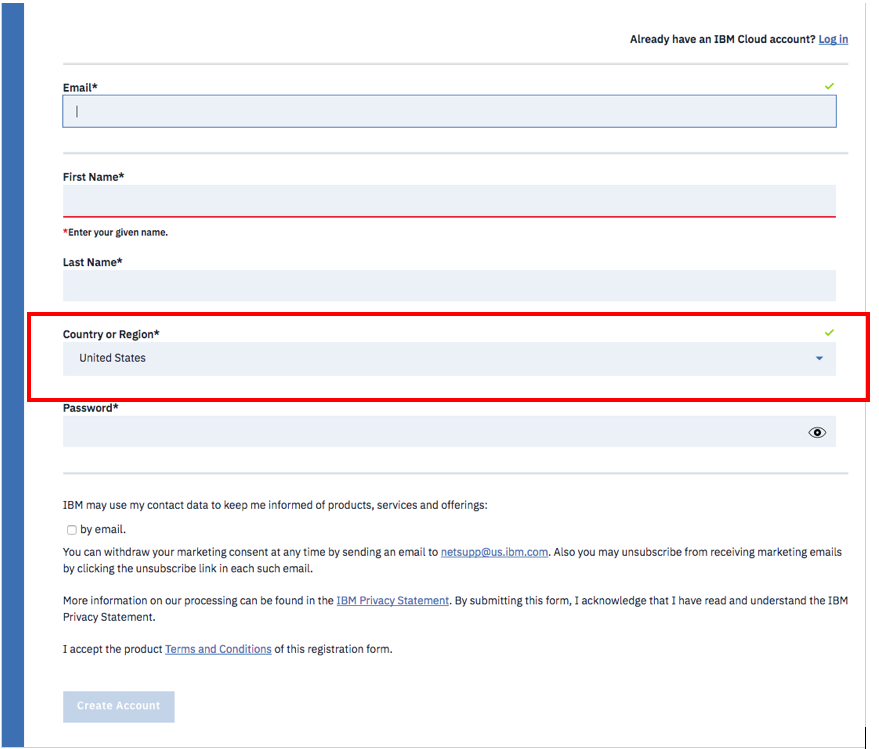

# Create your IBM Cloud account

+ You must create an account on the **IBM Cloud Platform**.

+ If you do not have an account yet, follow this link to register, using your IBM id: [https://cloud.ibm.com/registration?cm_mmc=EDHEC_Lille_DataViz2019](https://cloud.ibm.com/registration?cm_mmc=EDHEC_Lille_DataViz2019)

+ You’ll be registered for a lite account with no time restrictions, please chose `United States` or `United Kingdom`.

+ Click on **Create Account**.

+ You should receive an email with the Activation Link. `Click` on the link to complete the account creation.  

You now have a valid **IBM ID** and an **IBM Cloud** account. Next you will create a **Watson Studio** resource, instructions are available [here](ibm_watson.md)
