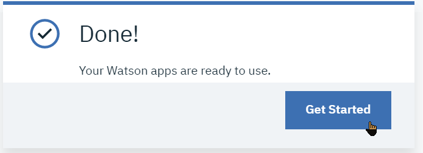

## Create an IBM Watson Studio instance
From **IBM Cloud**, we will instantiate a Watson Studio service, as the anchor for the toolset within IBM Cloud. Note that this is a one-time setup, only one instance of Watson Studio per region needs to be created.
1. Log-in to you IBM Cloud account's dashboard (at https://console.bluemix.net/dashboard/apps)
2. Click the `[Create Resource]` button at the top right 
3. In the search filter field, add the single word `studio`. This should reveal the lite services having the `studio` word in their name.  and click the `Watson Studio` tile.   
> NOTE: Make sure to use **`Watson Studio`**, and ***not*** *`Knowledge Studio`*
4. You are taken to the service creation page. Although it is possible to create an instance of Watson Studio in either `US South` or `United Kingdom` regions, it is recommended to use `US South` because this is where services, including new beta ones are updated first. You can change the service name suffix or keep the suggested name. Keep the `Lite` service plan and click the `[Create]` button.

NOTE: In the rest of the labs, if you created your Waston Studio instance in the `US-South` region, you will need to use the plain URLs without prefix, e.g. `dataplatform.ibm.com`, but if you created in the `United Kingdom` region, you will need to use the `eu-gb` URLs, e.g. `eu-gb.dataplatform.ibm.com`.

## Creating a Watson Studio project
Now that we have put in place the infrastructure to work with Data & AI, we can start creating a project for a specific data handling project.
1. If not already signed-in, login to your Watson Studio environment within IBM Data Platform. For this, go back to the IBM Cloud dashboard, select the `Watson Studio` service instance, and click the '[Get Started]' button .  
The first time you start the Watson Studio UI, you will be asked to confirm some details, click the `[Continue]` button: , and then validate    
Note that you can also go directly to the service's Cloud Web UI using the URL for the region where the service has been created, either https://dataplatform.ibm.com/projects?context=analytics for 'US-South' or https://eu-gb.dataplatform.ibm.com/projects?context=analytics for 'United Kingdom'
Create a new project using the `Create a Project` button tile     
Then select a `Standard` configuration. This governs which tools are made available to the project, and can be altered later if need be 
   
Validate with the `[OK]` button
1. Name this new project e.g. `WatStud_Workshop`.   
Note that you will want to leave the 'Restrict who can be a collaborator' unchecked, it will make sharing the project with another account more straightforward.   
Watson Studio stores its file-like artifacts into an instance of `Cloud Object Storage`, we will create a COS service instance at this stage:
   
   > Currently, your only choice is **IBM Cloud Object Storage**. Information stored with **IBM Cloud Object Storage** is encrypted, resilient and dispersed across multiple geographic locations, and accessed over HTTP using a REST API.  
   Each project and catalog has its own dedicated bucket.
   1. Select the Lite Plan 
   1. Accept the default names for resource group and Service name
   1. Back to the Project creation page, select Refresh then the new Object Storage service instance
   1. Finally, click **Create**:
   
Note that COS instance needs to be created only once, it will hold projects' artifacts in separate buckets for each.

## Loading Data Assets for the project
We will load some of the files used during the Hands-On lab as Data Assets available to your project.   
The files are available in the Box folder.
1. In your **IBM Watson Studio** project, switch to the `Assets` tab:
2. Initially the Data Assets list should be empty. If not opened yet, open the Data Pane by selecting the `1001` icon at top right: 
3. Select the `Load` tab 
4. Click Browse to add files that you will have downloaded to your computer's disk from the Box folder.   
Among the files that we will need, you can start loading the following ones:
The source data for these files can also be found at their original location on the web.   

|File name|Original location
|---|---
|`GoSales_Tx.csv`|https://dataplatform.cloud.ibm.com/exchange/public/entry/view/ba9a3008817bbf458eea4980294e618b
|`cars.csv`|https://dataplatform.cloud.ibm.com/api/exchange/actions/download-dataset/c81e9be8daf6941023b9dc86f303053b
|`201701-citibike-tripdata.csv`|https://www.citibikenyc.com/system-data
5. Once done, the files will show up in the `Data assets` list.

## Quick assessment of the Data Asset
You can quickly browse through sample from one of the Data Assets, so as to get an idea of the data format.

For example:
1. From the `Assets` tab in the project page, select the `cars.csv` data asset by clicking on it
2. This opens a preview of the data in tabular format. Data set has 9 columns and 406 rows.
> Note that you can change the Data Asset metadata such as the **Description** and the **Tags** from the **Information** side bar and clicking on the **pencil** to go in edit mode.

